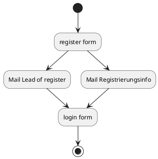
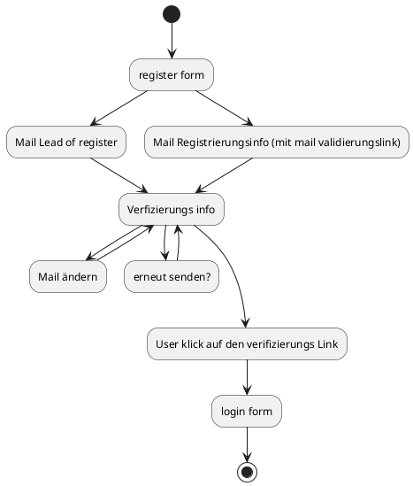
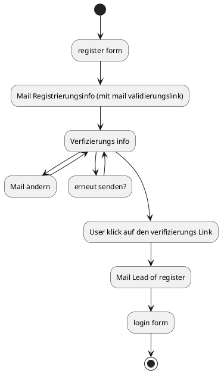

# Registrierungs flow

# Aktueller flow:

```plantuml

@startuml

(*) --> "register form"
--> "Mail Registrierungsinfo"
--> "login form"
"register form" -> "Mail Lead of register"
--> "login form"
--> (*)

@enduml

```

# Gewünschter flow:

```plantuml

@startuml

(*) --> "register form"
--> "Mail Registrierungsinfo (mit mail validierungslink)"
--> "Verfizierungs info"
"register form" -> "Mail Lead of register"
--> "Verfizierungs info"
--> "Mail ändern"
--> "Verfizierungs info"
--> "erneut senden?"
--> "Verfizierungs info"
---> "User klick auf den verifizierungs Link"
--> "login form"
--> (*)

@enduml

```

Oder ?

```plantuml

@startuml

(*) --> "register form"
--> "Mail Registrierungsinfo (mit mail validierungslink)"
--> "Verfizierungs info"
--> "Mail ändern"
--> "Verfizierungs info"
--> "erneut senden?"
--> "Verfizierungs info"
---> "User klick auf den verifizierungs Link"
--> "Mail Lead of register"
--> "login form"
--> (*)

@enduml

```
